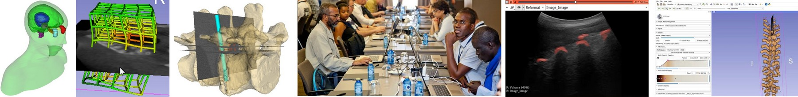

# Joint global workshop on Sustainable Development in Computer-Assisted Interventions and Diagnosis

The aim of this workshop, delivered as an intense three day bootcamp, is to provide training for engineering and computing students for best practices for prototyping of medical image computing, computer-assisted interventions and artificial intelligence applications in an open-source software environment. The workshop is also offered in support of Train the Trainers program that is established to develop sustainable technology development in medical interventions. It will be an online training event, offered by scientists and software engineers in Canada (Queen’s University, Carlton University, National Research Council), Spain (University of Las Palmas de Gran Canaria) and Senegal (Cheikh Anta Diop University, Ecole Supérieure Polytechnique).
 
Train the Trainer is an alliance of several institutions including Queen’s University, University of Las Palmas de Gran Canaria, Harvard Medical School, and several collaborators in West Africa particularly in Senegal and Mauritania, that is founded on the premise of innovative applications of free open-source software. The program supports a free, open-source medical image analysis and visualization software ecosystem [3D Slicer](http://www.slicer.org), downloaded over 1,000,000 times across the globe since its inception over 20 years ago. Sustainable development is based on free open source software, knowledge translation and closing the knowledge gap between historically privileged academic centres and those in low and middle income countries. 

## Logistics

- Date:	2022 May 24-26
- Location: Zoom + SpatialChat.
- Application: [fill this form to apply](https://forms.gle/d6coo4mE8EwsKiEC6) before May 18. We will notify each applicant by May 19 the latest.
- Any questions? Send an email to [Andras Lasso](mailto:lasso@queensu.ca).

## Pre-requisites

These were the pre-requisites for last year. This year they may be slightly different. Please check them again in a few days.

- Install [3D Slicer](https://download.slicer.org/) latest stable version (5.0.x). After you installed Slicer, start it, open the Extension manager (menu: View/Extension manager), and install these extensions: SlicerIGT, SlicerOpenIGTLink, DebuggingTools, SlicerElastix, SegmentRegistration, TCIABrowser, DICOMwebBrowser, SlicerDMRI, SlicerJupyter. If a popup is displayed asking about **Install dependencies**, always click **Yes** to install them.
- Install [Git for Windows](https://git-scm.com/download/win) and [TortoiseGit](https://tortoisegit.org/) if you have a Windows computer. On macOS and Linux, Git client is usually already installed by default. If you are not comfortable with using softare via the terminal then install a Git client with a graphical user interface, such as [GitHub Desktop](https://desktop.github.com/).
- [VisualStudio Code](https://code.visualstudio.com/). Install the Python extension from Microsoft (ms-python.python).
- If you don't have a GitHub account yet, then create one at www.github.com
- If you want to effectively participate in day 3: get familiar with Python and numpy syntax; spend some time to get to know VTK (read as much of the [VTK textbook](https://vtk.org/vtk-textbook/) as you can, try to run some of the [VTK examples](https://kitware.github.io/vtk-examples/site/) in Python) and learn about [Qt for Python](https://www.qt.io/qt-for-python) (for example, complete a few basic tutorials).
- Only for students at Queen's: Prepare with a short introduction about yourself (2-3 minutes, supported by 1-2 slides): experience, research interests, something personal
- Install zoom and familiarize yourself with [SpatialChat](https://spatial.chat/s/TryMe) (we will use it for hands-on sessions so that multiple participant can share screen and ask questions from instructors when they get stuck)
- Windows users: Download and install PLUS toolkit - stable 64-Bit version (2.8.0.20191105-Win64) from [here](http://perk-software.cs.queensu.ca/plus/packages/stable/).
- Windows users: Print a set of ArUco markers from [here](https://github.com/PlusToolkit/PlusLibData/raw/master/ConfigFiles/OpticalMarkerTracker/marker_sheet_36h12.pdf) at 100% scale.
- Download NeuroNav tutorial data from [here](https://onedrive.live.com/?authkey=%21AFREW52wtFabFbc&id=7230D4DEC6058018%2129575&cid=7230D4DEC6058018).

## Program

The program is subject to change at any time, so please check this page regularly.

Time zone: [Toronto, Canada (Eastern Time)](https://www.timeanddate.com/worldclock/canada/toronto).

### May 24, Tuesday: Introduction, 3D Slicer basics, Project management
- 9:00am Introduction (Sandra, Amitava, Juan, Gabor) `zoom`
- 9:15am Logistics, learning spatialchat (Andras) `spatialchat`
- 9:30am 3D Slicer basics 1/2 `zoom+spatialchat`
  - Overview: core features, community, major extensions (20 min, Andras)
  - Visualization: load/save, sample data, viewers, models, volume rendering (40 min, Csaba/David hands-on, help: Andras, Kyle, Tamas, Csaba, David, Monica, in French: Marie)
- _10:30am Break_
- 10:45am 3D Slicer basics 2/2 (Andras hands-on, help: Kyle, Tamas, Csaba, David, Monica, in French: Marie)
  - DICOM (10 min)
  - Segmentation (50 min)
  - Registration: Elastix, landmark registration, SegmentRegistration, transforms, transform visualization (30 min)
- _12:15pm Lunch break_
- 1:00pm	Lab policies, available services, and guides (Tamas, Laura) _– only for students at Queen's_ `zoom`
- 1:30pm	Introduction of participants and instructors (all) _– only for students at Queen's_ `zoom`
- _2:15pm	Coffee break_ - bring your own beverage, get to know all the participants `zoom+spatialchat`
- 2:30pm	Software platform, open-source, reproducible science (Andras) `zoom`
- 3:00pm Project management (Andras; hands-on, help: Kyle) `zoom+spatialchat`
- 4:00pm	Adjourn

### May 25, Wednesday: AI for image-guided interventions
- 9:00am AI: `zoom+spatialchat`
  - Overview (nomenclature, libraries - Tensorflow, Pytorch, MONAI, complete system) (15 min, Tamas)
  - Ultrasound training data generation (Single-slice segmentation module, 20 min, Tamas, hands-on, helpers: TBD)
  - Ultrasound AI segmentation (20 min, Tamas, hands-on, helpers: TBD)
  - Tracking data evaluation (20 min, Matthew TBD)
  - MONAILabel (15 min, Andras, hands-on, helpers: TBD)
- _10:30am	Break_
- 10:45am Prototyping image-guided therapy applications (Csaba, David, Monica)
- _12:15pm	Lunch break_
- 1:00pm Sequences, SlicerIGT modules (Kyle) `zoom`
- _2:30pm Break_
- 2:45pm Neuronavigation tutorial (Kyle; hands-on, help: Andras, Tamas) `zoom+spatialchat`
- 4:00pm	Adjourn

### May 26, Thursday: Slicer module development
- 9:00am	Writing correct and understandable code (Andras) `zoom`
- 9:30am	Programming Slicer - part 1: 3D Slicer programming overview (Andras) `zoom`
- 10:00am Programming Slicer - part 2: Python basics and developing simple example Python module Center of Masses (Csaba, hands-on, help: Kyle, Andras, Tamas, David, Monica, Mark; in French: Marie) `zoom+spatialchat`
- _12:15pm	Lunch break_
- 1:00pm	Programming Slicer - part 3: Individual work to develop a more advanced module (hands-on, help: Kyle, Andras, Tamas) `zoom+spatialchat`
- 4:00pm	Adjourn

Presentation slides and additional files will be available in this repository.
